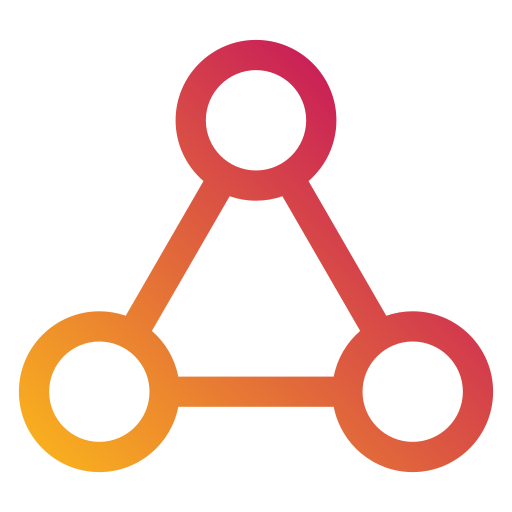

<p align="center">
  
</p>

<h1 align="center">CodeHub</h1>

<p align="center">
  <strong>A birds-eye view of every repository on your machine — and where the work is hiding.</strong>
</p>

<p align="center">
  
  
  
  
</p>

> **Alpha software.** CodeHub is early and moving fast. Settings, storage, the API, and the dashboard
> can change between 0.x releases. Run it, kick the tires, and tell us what breaks.

## What it is

If you maintain more than a handful of repositories, you already know the feeling: one has tests
rotting, another is three majors behind on a dependency, a third has an open PR you forgot about,
and a fourth quietly grew a security advisory last week. The information exists — it's just scattered
across dozens of folders, tabs, and CI dashboards, and nobody has the time to walk all of it.

CodeHub is a small local console that walks it for you. Point it at the directories where your code
lives, and it inventories every repository, scores each one on a handful of health signals, and puts
the ones that need attention at the top of a single table. It runs entirely on your machine — one
`dotnet run`, one browser tab — and the only thing that leaves your box is an optional call to the
GitHub API for issue and PR counts.

## What it does

For every repository it discovers, CodeHub answers one question per row — *does this need my
attention, and why?* — across five signals, each shown as a red / yellow / green light with the
evidence one hover away:

- **Tests** — is the code actually covered by an automated test project?
- **Telemetry** — do the web services expose metrics/traces, or are they flying blind?
- **Dependencies** — how far behind is each package (`dotnet list package --outdated`)?
- **Security** — any vulnerable packages or open Dependabot alerts?
- **Issues / PRs** — how much open issue and pull-request pressure is sitting there?

Alongside those it surfaces the current version, branch, commits ahead/behind `main`, last commit
date, and languages — then rolls it all into one overall grade so you can sort the whole tree by
"most neglected" and start at the top.

## Features

- **One row per repository, filter every column.** Text filters for name/version/branch, dropdowns
  for language, commit divergence, last-update window, and each signal's status. Sort any column.
- **Drill-down detail.** Click a repo to see its discrete projects, outdated/vulnerable dependencies,
  the exact evidence behind each signal, and its GitHub issues/PRs/Dependabot state.
- **You choose what's scanned.** A lazy, sandboxed directory picker with tri-state checkboxes — pick
  whole trees or individual repos; the selection is remembered.
- **Fast re-scans.** Unchanged git repositories are skipped by comparing HEAD, so a rescan only does
  the work that changed. Collection runs in parallel up to a concurrency you set.
- **Polyglot discovery.** Finds .NET, Node, Python, and PowerShell projects; reports version, last
  update, and dependency freshness across all of them.
- **Jump straight into work.** On Windows, open any repo in Explorer, a terminal, **Claude**, or
  **Codex** right from its row.
- **Batteries included.** Editable settings, an OpenAPI-driven API Explorer, request history, and a
  dashboard served by the backend itself at `/dashboard` — no separate web server to run.
- **Local and quiet.** SQLite on disk, a single static API key, and no telemetry phoned home.

## Who it's for

CodeHub is built for the developer or maintainer who owns *many* repositories and wants a command
center for them:

- The open-source maintainer with twenty libraries who wants to know, at a glance, which ones have
  drifted out of date or grown an open PR that needs triage.
- The polyglot developer whose `~/code` folder has quietly become a small city and who wants a map of
  it — what's healthy, what's stale, what's insecure.
- Anyone doing a "cleanup weekend" who wants to attack the worst-off repositories first instead of
  guessing.

It is deliberately a *local* tool: your birds-eye view, on your machine, for the code you already
have checked out.

## Getting started

You need the [.NET 8 or .NET 10 SDK](https://dotnet.microsoft.com/download) and
[Node.js](https://nodejs.org/) (the dashboard is built automatically during the .NET build).
CodeHub multitargets `net8.0` and `net10.0`.

### The really simple way

Clone it and run the launcher script — that's the whole thing:

```bash
git clone https://github.com/jchristn/codehub.git
cd codehub
./go.sh        # macOS / Linux
go.bat         # Windows
```

It builds the dashboard and backend, then starts the server on the standard port. Once it's up open:

```
http://127.0.0.1:8090/dashboard
```

The launcher runs on `net10.0` by default. Pass a framework to pick the runtime:

```bash
./go.sh net8.0     # macOS / Linux
go.bat net8.0      # Windows
```

### The manual way

If you'd rather drive it yourself (the `--framework` flag is required because the project multitargets):

```bash
cd codehub/src
dotnet run --project CodeHub.Server --framework net10.0
```

The build compiles the React dashboard and the backend serves it, so once it's up open the same URL:

```
http://127.0.0.1:8090/dashboard
```

The login screen pre-fills the server URL; enter the API key (default `codehub-dev-key`, changeable
in `codehub.json`) and you're in. Open the **directory picker**, choose the folders you want watched,
hit **Scan Now**, and the table fills in.

Want a different port?

```bash
dotnet run --project CodeHub.Server -- --port 8000
```

### GitHub personal access token

The **Issues / PRs / Dependabot** and **Archived** columns come from the GitHub API, so they only
populate once you give CodeHub a GitHub personal access token (PAT). Add it to the `github` section of
`codehub.json`:

```json
"github": {
  "personalAccessToken": "ghp_your_token_here",
  "owner": ""
}
```

Then restart CodeHub and run a scan. You can also set it from the **Settings** page in the dashboard
(which writes back to the same file), or via the `CODEHUB_GITHUB_PAT` environment variable. A
classic PAT with the `repo` scope (plus `security_events` if you want Dependabot alerts) is enough;
a fine-grained token with read access to the repositories works too. Without a token, everything else
still works and the GitHub-derived columns simply stay blank.

> **Heads up:** the first full scan of a large tree runs `dotnet list package --outdated` per project
> and can take a while. Every scan after that is incremental and quick. You can turn dependency
> checking off in Settings if you want structural signals only.

## Configuration

All settings live in `codehub.json`, organized into sections (`webserver`, `cors`, `authentication`,
`database`, `directories`, `scan`, `github`, `logging`, `requestHistory`, `modelRunner`). You can edit
the file directly or use the **Settings** page in the dashboard, which writes back to the same file.
A few environment variables (`CODEHUB_AUTH_API_KEY`, `CODEHUB_GITHUB_PAT`, `CODEHUB_SCAN_ROOT`,
`CODEHUB_PORT`) override the corresponding values, and `--port` / `--hostname` / `--root` override on
the command line.

## Filing issues and starting discussions

Found a bug, hit a rough edge, or have an idea? That feedback is exactly what an alpha needs.

- **Bugs and feature requests:** open an issue at
  [github.com/jchristn/codehub/issues](https://github.com/jchristn/codehub/issues). A repro, your OS,
  and what you expected versus what happened go a long way.
- **Questions and ideas:** start a thread in
  [Discussions](https://github.com/jchristn/codehub/discussions) — great for "would you take a PR
  for X?", workflow ideas, or just showing how you use it.

## Contributing

Contributions are welcome, and small ones are a great way in.

1. Fork the repo and create a branch from `main`.
2. Make your change. The backend follows a strict C# style (no `var`, no tuples, in-namespace
   `using` directives, one type per file); the dashboard is React 19 + Vite with ESLint.
3. Build and test: `dotnet build` from `src/` compiles both the backend and the dashboard, and
   `dotnet run --project Test.Automated` runs the Touchstone suites.
4. Open a pull request describing the change and why. For anything large, open an issue or a
   Discussion first so we can agree on the shape before you invest the time.

## License

CodeHub is released under the [MIT License](LICENSE.md) — free to use, modify, and distribute, with
no warranty. See the license file for the full text.

## Attribution

Logo and interface iconography: <a href="https://www.flaticon.com/free-icons/user-interface" title="user interface icons">User interface icons created by gravisio - Flaticon</a>.
